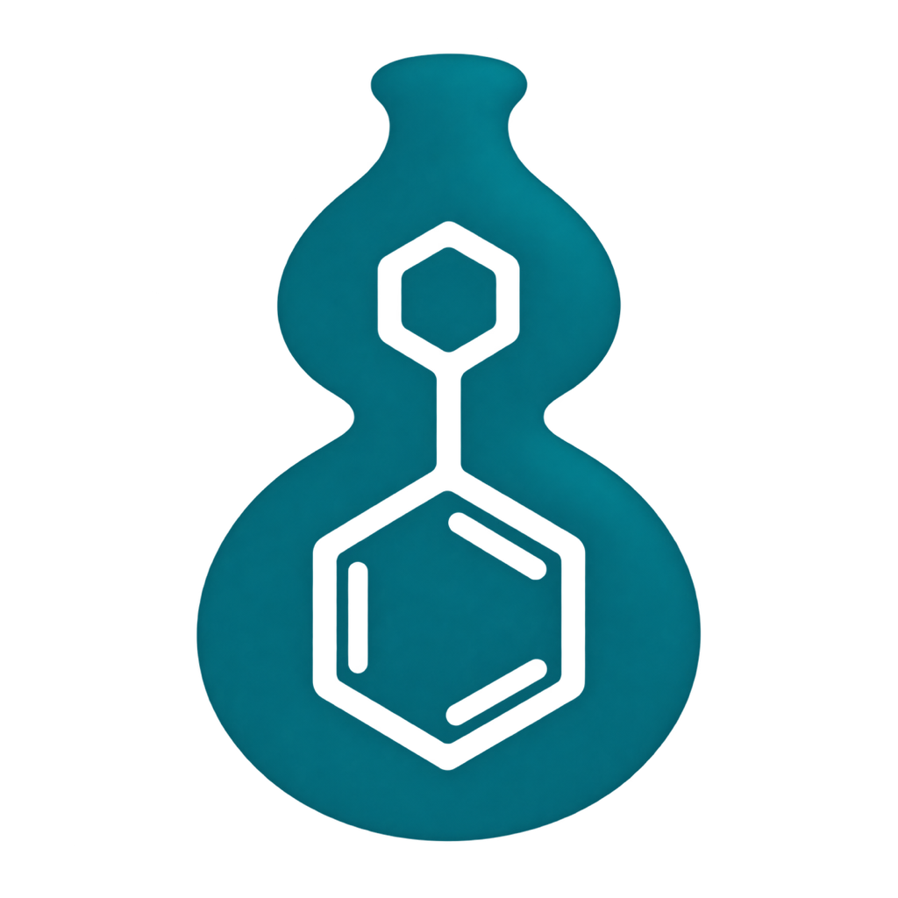
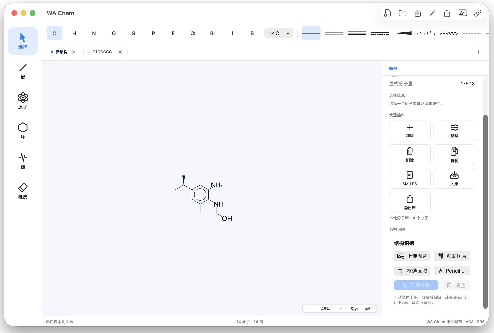

# WA Chem

<p align="center">
  
</p>

**WA Chem** 专注做好一件事：把画二维化学结构做到像 ChemDraw 一样快速、顺手。它是一个轻量的本地工作台，开箱即用、数据留在本地，并可接入 [WA-DD](https://wa-dd.fuluwa.top) 进行配体结构编辑管理。



## 主要功能

### 结构绘制

- 常用元素一键标注：选中或悬停原子后直接键入元素符号（支持 `Cl`、`Br`、`Na` 等多字符元素）；
- 单键、双键、三键、芳香键、楔形/虚楔形立体键、波浪键、配位键等键型，工具栏图标即实际画法；
- 3–8 元环模板与苯环（支持 Kekulé 双键与芳香圆圈两种画法）、锯齿链工具、橡皮擦；
- ChemDraw 风格键鼠交互：拖拽画键自动吸附标准键长与 30° 网格、`+` / `-` 调整形式电荷、双击选中整个片段、Option-拖拽复制、空格平移、滚轮缩放、撤销重做与快捷键；
- 选区包围盒内任意位置可直接拖拽复制片段，选区一键复制为透明 PNG，粘贴 SMILES 文本即自动布局为可编辑结构；
- 结构清理一键重排，ACS 1996 与 WA 两套显示风格。

### 结构识别（OCSR，规划中）

- 计划支持上传图片、粘贴截图或在画布中框选区域进行识别，结果转换为可编辑的原子与键；
- 识别结果带置信度，低置信度对象高亮显示，可在原图叠加下逐项快速纠错。

### 数据与联动

- 独立账号体系与访客临时使用，文档按用户隔离存储；
- 连接 [WA-DD](https://wa-dd.fuluwa.top) 后可浏览项目中的配体资产与分子，一键载入画布继续编辑；也可将当前分子新建为配体资产、追加到现有资产或替换其中分子；支持同一 Docker 网络自动发现或手动输入地址；
- 本地 SDF 分子库：常用分子随手保存、跨文档复用，支持多资产管理与 SDF 导出；
- 完整的导入导出：Molfile、SDF、SMILES、CDXML（ChemDraw 交换格式）导入与导出（CDXML 导入暂限 Web 版），SVG / PNG 图像导出，自有 `.wachem` 文档格式完整保留编辑状态，并在 macOS 与 iPad 上注册为系统文档类型；导入自动识别格式。

## 获取与使用

### Mac 客户端

从 [WA Chem 公开下载页](https://wa-chem.fuluwa.top/#releases) 下载最新 `wa-chem-mac_<version>_aarch64.dmg`（Apple Silicon），拖入「应用程序」即可使用。Mac 客户端直接使用当前 macOS 系统账户作为本地身份，文档保存在当前用户的数据目录；WA-DD 凭据保存在钥匙串中。

### 服务器版（自托管）

```sh
./deploy/deploy.sh
```

部署完成后通过 `http://<host>:8799` 访问（避开 WA-DD 默认的 8800 端口）。服务器版提供注册/登录、WA-DD 账号直接登录和免登录临时使用三种进入方式；未安装 WA-DD 时可独立运行，之后随时连接。

数据默认保存在部署目录的 SQLite 中，识别模型在本地推理，不需要把化学结构上传到外部服务。

## 支持的平台

| 平台 | 形态 |
| --- | --- |
| macOS（Apple Silicon） | 原生应用（SwiftUI + Metal 画布，CoreGraphics 导出/降级） |
| iPad | 原生应用（与 Mac 共享同一套代码，发布准备中） |
| 浏览器 | 服务器版 Web 应用 |

Mac 与 iPad 由同一套原生编辑器核心驱动，Web 版提供一致的绘制能力。

## 技术栈

- **原生应用（Mac + iPad，`apps/macos-native`、`apps/ipad`）**：Swift 6 纯原生实现（macOS 13+ / iPadOS 16+），不内嵌任何 JS/WebView。编辑器状态、化学规则、格式解析与交互手势全部为原生 Swift，封装在跨平台共享库 `WAChemAppleCanvas` 中，Mac 与 iPad 复用同一套编辑模型、画布交互与 SwiftUI 界面代码。SwiftUI 负责界面，Metal 负责画布（MSAA 4x、场景图元 CPU 细分 + 顶点着色器相机变换、文字纹理图集，iPad 端为 UIKit Metal 画布并支持 Apple Pencil），CoreGraphics 负责导出与降级绘制。本地文档与分子库以 JSON 清单持久化，WA-DD 凭据保存在钥匙串。零第三方依赖。
- **Web 应用**（`apps/web`）：React 19 + TypeScript + Vite，SVG 渲染画布；TypeScript 编辑器核心与原生核心行为对齐，Molfile V2000、SDF、SMILES（常用子集）、CDXML（子集）、SVG 解析与导出均为自研实现，不依赖 RDKit 等化学信息学库。自研 `EditorCore` 外部 store 经 `useSyncExternalStore` 接入 React，草稿用 IndexedDB 本地持久化；Vitest 测试。
- **服务器端**（`services/api`）：Python 3.11+ / FastAPI + Uvicorn + Pydantic，SQLite（WAL）存储用户与文档，PBKDF2 口令散列、Fernet 加密 WA-DD 令牌；Docker Compose 一体部署，nginx 托管 Web 静态文件并反代 `/api`。
- **OCSR 识别**：规划采用 MolParser-Mobile（服务器 PyTorch、Mac Core ML 双产物）；部署侧的模型目录挂载与配置项已就位，推理服务尚未落地。

## 文档

- [文档索引](docs/README.md)
- [开发指南](docs/DEVELOPMENT.md)：构建、测试、发版流程
- [架构决策记录](docs/adr/0001-editor-core-contract.md)
- [ChemDraw / InDraw 交互对标清单](docs/chemdraw-parity.md)

## 许可证

尚未确定。第三方代码、模型权重和训练数据在引入前分别完成许可证与再分发条件审查。
