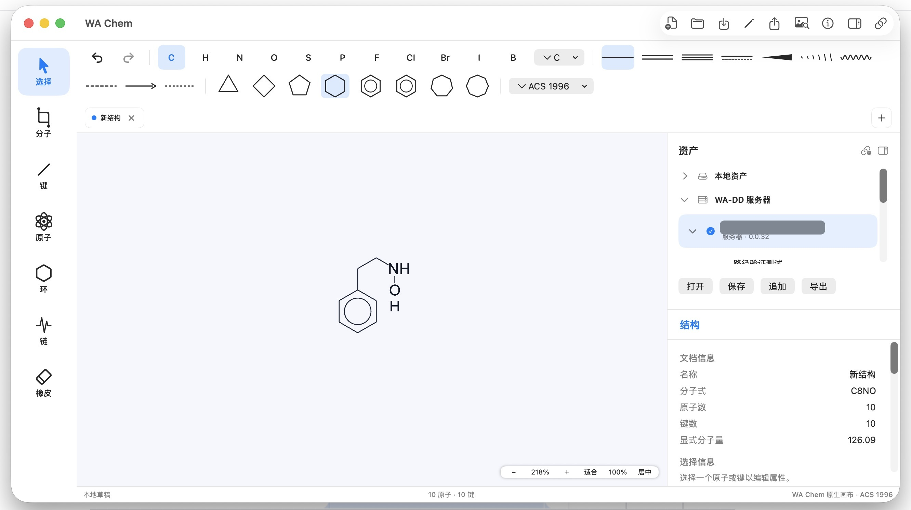
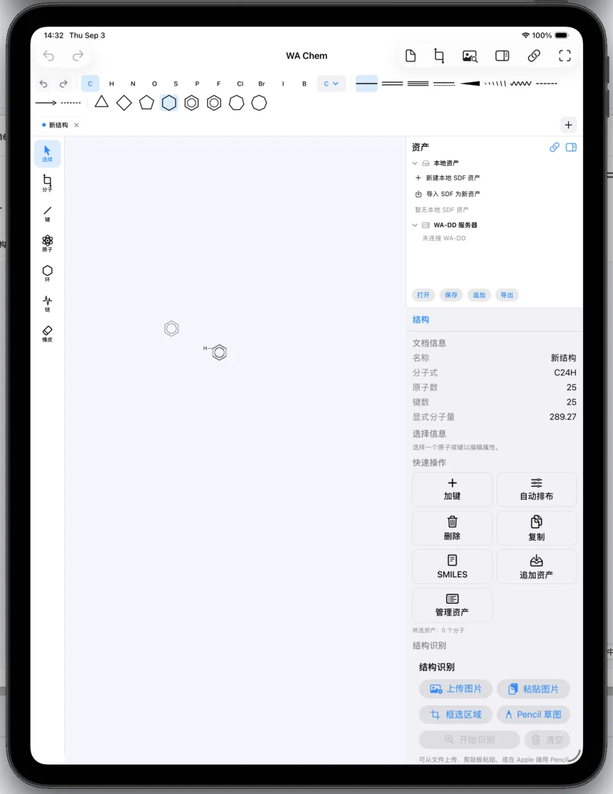

# WA Chem

<p align="center">
  
</p>

**WA Chem** 专注做好一件事：把画二维化学结构做到像 ChemDraw 一样快速、顺手。它是一个轻量的本地工作台，开箱即用、数据留在本地，并可接入 [WA-DD](https://wa-dd.fuluwa.top) 进行配体结构编辑管理。



### Mac 与 iPad，统一原生体验

WA Chem 在 Mac 与 iPad 上使用同一套原生 Apple 应用、共享同一套编辑器与资产管理逻辑；界面会针对键鼠、触控和 Apple Pencil 自然适配，不需要在两个产品之间切换。

<p align="center">
  
</p>

## 主要功能

### 结构绘制

- 常用元素一键标注：选中或悬停原子后直接键入元素符号（支持 `Cl`、`Br`、`Na` 等多字符元素）；
- 单键、双键、三键、芳香键、楔形/虚楔形立体键、波浪键、配位键等键型，工具栏图标即实际画法；
- 3–8 元环模板与苯环（支持 Kekulé 双键与芳香圆圈两种画法）、锯齿链工具、橡皮擦；
- ChemDraw 风格键鼠交互：拖拽画键自动吸附标准键长与 30° 网格、`+` / `-` 调整形式电荷、双击选中整个片段、Option-拖拽复制、空格平移、滚轮缩放、撤销重做与快捷键；
- 选区包围盒内任意位置可直接拖拽复制片段，选区一键复制为透明 PNG，粘贴 SMILES 文本即自动布局为可编辑结构；
- 结构清理一键重排，ACS 1996 与 WA 两套显示风格。

### 结构识别（OCSR）

- Web 服务器版支持上传图片、粘贴截图和框选裁剪区域，调用本地 OCSR worker 后把 `molblock` 或 canonical SMILES 导入为新画布中的一个可编辑分子；
- Apple app 使用同一识别结果协议，首版把同版本 Core ML 模型产物作为 app resource 打包，本机完成 detector、decoder，并把图片或 Apple Pencil 草图识别结果导入为新画布中的一个可编辑分子；
- 两端都会显示模型就绪状态；模型缺失或校验未完成时，识别入口保持禁用并说明原因；
- 识别结果携带模型版本、运行时、整体置信度和多分子明细；低置信度叠加纠错界面按后续冻结集评测结果继续完善。

### 数据与联动

- 独立账号体系与访客临时使用，文档按用户隔离存储；
- 连接 [WA-DD](https://wa-dd.fuluwa.top) 后可浏览项目中的配体资产与分子，一键载入画布继续编辑；也可将当前分子新建为配体资产、追加到现有资产或替换其中分子；支持同一 Docker 网络自动发现或手动输入地址；
- 本地 SDF 分子库：常用分子随手保存、跨文档复用，支持多资产管理与 SDF 导出；
- 完整的导入导出：Molfile、SDF、SMILES、CDXML（ChemDraw 交换格式）导入与导出（CDXML 导入暂限 Web 版），SVG / PNG 图像导出，自有 `.wachem` 文档格式完整保留编辑状态，并在 Apple app 中注册为系统文档类型；导入自动识别格式。

## 获取与使用

### Apple app

Apple app 是同一个原生产品目标，面向 iPad 与 Mac 一次上架。开发/测试阶段仍可从 [WA Chem 公开下载页](https://wa-chem.fuluwa.top/#releases) 获取 `wa-chem-apple_<version>_aarch64.dmg` 直装包；App Store 渠道使用同一 bundle id `top.fuluwa.wa-chem`。本地资产与 WA-DD 连接信息走 Apple 账户文件夹与 iCloud 同步开关；WA-DD 凭据保存在系统钥匙串。

### 服务器版（自托管）

```sh
./deploy/deploy.sh
```

部署完成后通过 `http://<host>:8799` 访问（避开 WA-DD 默认的 8800 端口）。服务器版提供注册/登录、WA-DD 账号直接登录和免登录临时使用三种进入方式；未安装 WA-DD 时可独立运行，之后随时连接。同机装有 WA-DD 时，部署脚本会自动接入其 Docker 网络；找不到时也会把 `wa-dd-web` 指向宿主机，在界面输入 `wa-dd-web` 即可连上宿主 8800 端口上运行的 WA-DD。

数据默认保存在部署目录的 SQLite 中，识别模型在本地推理，不需要把化学结构上传到外部服务。

## 支持的平台

| 平台 | 形态 |
| --- | --- |
| Apple app（iPad + Mac） | 一个原生 Apple app 目标；共享 SwiftUI + Metal 画布、资产、WA-DD、iCloud、Keychain 与编辑语义 |
| 浏览器 | 服务器版 Web 应用 |

Apple app 与 Web 版是两条运行线，但用户可见的化学绘制、资产与 WA-DD 语义必须保持一致。

### 为什么没有 Windows / iPhone 客户端

- **Windows**：短期内没有计划。原因很直接——预算有限，目前没有 Windows 电脑可用于开发验证；而 OCSR 推理和后续模型迭代依赖 CUDA 加速，Windows 版需要在真实的 Windows + NVIDIA 环境上开发与实测，等有条件再启动。
- **iPhone**：交互上不划算。结构绘制和纠错需要精确点选单个原子、单根键并频繁微调，手机屏幕上误触率高、操作局促；尤其当识别结果出错时，在原图叠加下逐项修正结构，在手机上会非常难受。移动端的合理形态是 iPad + Apple Pencil。

## 技术栈

- **Apple app（`apps/apple` + `WAChemAppleCanvas`）**：Swift 6 纯原生 Universal Apple app（iPadOS 16+，Mac Catalyst / macOS 13+），不内嵌任何 JS/WebView。编辑器状态、化学规则、格式解析、资产、WA-DD、iCloud、Keychain 与交互语义全部封装在跨平台共享库 `WAChemAppleCanvas` 中；平台代码只做触控、指针、键盘、文件面板、菜单与窗口能力适配。SwiftUI 负责界面，Metal 负责交互画布（MSAA 4x、场景图元 CPU 细分 + 顶点着色器相机变换、文字纹理图集），CoreGraphics 负责 PNG/SVG 等导出，以及 Metal 不可用或测试快照场景下基于同一场景图的后备绘制。本地文档与分子库以 JSON 清单持久化。零第三方依赖。
- **Web 应用**（`apps/web`）：React 19 + TypeScript + Vite，SVG 渲染画布；TypeScript 编辑器核心与原生核心行为对齐。当前 Molfile V2000、SDF、SMILES（常用子集）、CDXML（子集）、SVG 解析与导出以自研实现为主；服务器版允许按需要引入 RDKit、Open Babel 等后端化学信息学能力，只要用户可见的化学语义与 Apple app 保持一致。自研 `EditorCore` 外部 store 经 `useSyncExternalStore` 接入 React，草稿用 IndexedDB 本地持久化；Vitest 测试。
- **服务器端**（`services/api`）：Python 3.11+ / FastAPI + Uvicorn + Pydantic，SQLite（WAL）存储用户与文档，PBKDF2 口令散列、Fernet 加密 WA-DD 令牌；Docker Compose 一体部署，nginx 托管 Web 静态文件并反代 `/api`。
- **OCSR 识别**：采用 MolParser-Mobile（服务器 PyTorch、Apple app Core ML 双产物）。服务器版通过独立 `wa-chem-ocsr` worker 读取 `MODEL_HUB_SHARED_MODELS_PATH` 下的 ModelScope 模型；也可在构建 worker 镜像时设置 `WA_CHEM_OCSR_BUNDLE_MODEL=true` 下载并校验模型，不把权重打进普通 API 镜像。worker 镜像按硬件提供 `amd` / `arm` / `l4t` / `thor` 等 profile，各分 CPU 与 CUDA 变体；Apple 端 Core ML 产物经 `scripts/sync_apple_ocsr_model.sh` 校验同步为 app 资源。默认 PyTorch 模型包由内置 MolParser-Mobile runner 执行，其他模型包可通过 [OCSR 模型包合同](docs/ocsr-model-contract.md) 声明 runner；API 和 Web 只代理统一识别协议。VOS/Web 的模型下载与同步复用通用 Model Hub 管理方式；Apple app 使用同版本 Core ML 产物作为 app 资源打包，并保留 manifest/version 校验。

## 文档

- [文档索引](docs/README.md)
- [开发指南](docs/DEVELOPMENT.md)：构建、测试、发版流程
- [架构决策记录](docs/adr/0001-editor-core-contract.md)
- [ChemDraw / InDraw 交互对标清单](docs/chemdraw-parity.md)

## 许可证

尚未确定。第三方代码、模型权重和训练数据在引入前分别完成许可证与再分发条件审查。
